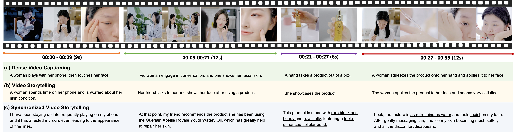

<div align="center">

<h2>Synchronized Video Storytelling: Generating Video Narrations with Structured Storyline</h2>

Dingyi Yang, Chunru Zhan, Ziheng Wang, Biao Wang, Tiezheng Ge, Bo Zheng, Qin Jin 

</div>

<p align="center">
    <a href="https://arxiv.org/abs/2405.14040"> 
        
    </a>

</p>


## Abstract

Video storytelling is engaging multimedia content that utilizes video and its accompanying narration to share a story and attract the audience, where a key challenge is creating narrations for recorded visual scenes. Previous studies on dense video captioning and video story generation have made some progress. However, in practical applications, we typically require synchronized narrations for ongoing visual scenes. 

In this work, we introduce a new task of **Synchronized Video Storytelling**, which aims to generate synchronous and informative narrations for videos. These narrations, associated with each video clip, should relate to the visual content, integrate relevant knowledge, and have an appropriate word count corresponding to the clip's duration. Specifically, a structured storyline is beneficial to guide the generation process, ensuring coherence and integrity. To support the exploration of this task, we introduce a **new benchmark dataset E-SyncVidStory** with rich annotations. Since existing Multimodal LLMs are not effective in addressing this task in one-shot or few-shot settings, we propose a framework named VideoNarrator that can generate a storyline for input videos and simultaneously generate narrations with the guidance of the generated or predefined storyline. We further introduce a set of evaluation metrics to thoroughly assess the generation. Both automatic and human evaluations validate the effectiveness of our approach. 

<div align="center">
  
</div>
<div align="center">
  <figcaption>Comparison of Synchronized Video Storytelling and existing video-to-text generation tasks.</figcaption>
</div>

## Release :loudspeaker:

- **2024/07/17**: Our code and dataset annotations are released. Video features will be available soon.

## Contents
- [Abstract](#abstract)
- [Release :loudspeaker:](#release-loudspeaker)
- [Contents](#contents)
- [Install](#install)
- [Dataset](#dataset)
- [Train](#train)
- [Inference](#inference)
- [Evaluation](#evaluation)
- [Citation](#citation)

## Install

1. Clone this repository
```bash
git clone https://github.com/alibaba/alimama-video-narrator
cd alimama-video-narrator

```

2. Install Package
```bash
pip install --upgrade pip
conda env create -f environment.yml
```

## Dataset
1. File

Our annotations can be found at "/data/all_video_data.json".

2. Data Process

Due to copyright considerations, we will release the features of the original videos (coming soon).

If you want to extract features from your raw videos, please download all videos and store them in "/data_process/all_videos/". Then, proceed to extract the video features:
```bash
cd data_process/
python process_video.py
python get_blip_fea.py
```
Get the training data:
```shell
cd data_process/
# Visual Compression & Memory Consolidation
python get_training_data.py ./blip_fea/video_cuts/ ../data/all_video_data.json 
cp training_data.json ../data/split/

cd ../data/split/
python split.py training_data.json ../all_video_data.json
python get_cut_data.py train.json train_shots.json
```

## Train
```shell
We apply the pretraining model firefly-baichuan-7b, with the details shown in: https://github.com/yangjianxin1/Firefly
You can directly use the baichuan-7b model, downloaded from: https://huggingface.co/baichuan-inc/Baichuan-7B
```
Run the following shell script to train your model:
```shell
bash train.sh
```

## Inference
Run the following shell script for inference. Set 'offered_label' to False to generate narrations based on the model-generated storyline; otherwise, set it to True to use the ground truth (user-provided) storyline.
```shell
bash infer.sh
```

## Evaluation
1. Standard metrics such as BLEU and CIDEr
```shell
python tokenize_output.py $chk_path/output.json
cd metrics/evaluator_for_caption/
python evaluate_ads.py $chk_path/out_tokens.json
```
2. Visual Relevance (EMScore & EMScore_ref)
```shell
Download Chinese_CLIP model from: https://huggingface.co/OFA-Sys/chinese-clip-vit-base-patch16
```
```shell
cd metrics/EMScore/
python eval_ad_with_ref.py --inpath $chk_path/output.json
```
"EMScore(X,V) -> full_F" refers to EMScore；"EMScore(X,V,X*) -> full_F" refers to EMScore_ref
3. Knowledge Relevance
```shell
Download chinese-roberta-large model from: https://huggingface.co/hfl/chinese-roberta-wwm-ext-large
```
```shell
cd metrics/roberta_based/
# info_sim
python info_sim.py ../data/all_video_data.json $chk_path/output.json idf_with_all_ref.json
# info_diverse
python info_diverse.py $chk_path/output.json idf_with_all_ref.json 
```
4. Fluency (intra-story repetition)
```shell
cd metrics/roberta_based/
python count_intra_repeat.py chk_path/output.json
```

## Citation

If you find our work useful for your research and applications, please cite using this BibTeX:

```bibtex
@misc{yang2024synchronizedvideostorytellinggenerating,
      title={Synchronized Video Storytelling: Generating Video Narrations with Structured Storyline}, 
      author={Dingyi Yang and Chunru Zhan and Ziheng Wang and Biao Wang and Tiezheng Ge and Bo Zheng and Qin Jin},
      year={2024},
      eprint={2405.14040},
      archivePrefix={arXiv},
      primaryClass={cs.MM},
      url={https://arxiv.org/abs/2405.14040}, 
}
```
